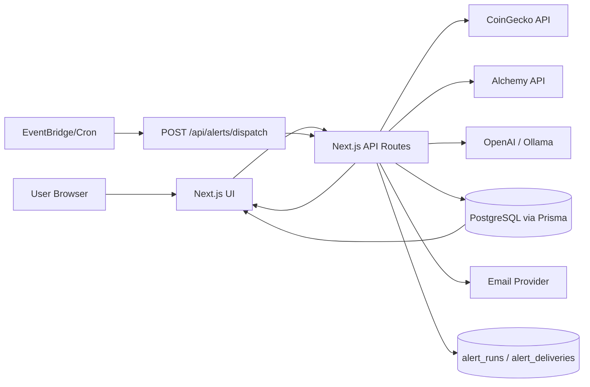
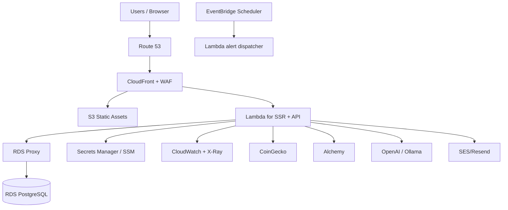

# Crypto Tracker

Crypto Tracker is a modern crypto intelligence app that combines market data, portfolio visibility, alerts, and AI guidance in one product.

## Why this app
- Fast market visibility: top coins, screener, movers, and trend context.
- Personal utility: wallet connect + portfolio valuation + saved preferences.
- Better decisions: AI assistant for explanations and portfolio-level context.
- Production-ready foundation: auth, rate limits, alerts, scheduler-safe dispatch, and Postgres persistence.

## Core Features
- Market overview and screener (CoinGecko-backed)
- Coin detail + chart
- Portfolio balances and USD valuation (Alchemy + CoinGecko mapping)
- Wallet connectors (Injected / WalletConnect / Coinbase)
- AI assistant:
  - floating widget for quick help
  - full `/chat` page for deeper conversation
- Signup/signin/signout with secure session cookie
- Persisted user data (preferences, saved wallets)
- Alert rules + dispatch + run history
- Backtesting Lite (DCA weekly / buy dip)
- Readiness, predeploy, and postdeploy checks

## Tech Stack
- Next.js (App Router) + TypeScript
- React Query
- Wagmi + Viem
- Prisma + PostgreSQL
- Zod validation

## Quick Start
From repo root:

1. Install dependencies
```bash
npm install
```

2. Create env file
```bash
cp crptotracker-workspace/.env.example crptotracker-workspace/.env
```

3. Set minimum required values in `crptotracker-workspace/.env`
- `ALCHEMY_API_KEY`
- `AUTH_SECRET`
- `DATABASE_URL`
- `ALERTS_CRON_SECRET`
- For AI:
  - `LLM_PROVIDER=openai` with `OPENAI_API_KEY` + `OPENAI_MODEL`, or
  - `LLM_PROVIDER=ollama` with `OLLAMA_BASE_URL` + `OLLAMA_MODEL`
- For WalletConnect:
  - `NEXT_PUBLIC_WALLETCONNECT_PROJECT_ID`

4. Run Prisma
```bash
npm run prisma:generate
npm run prisma:migrate
```

5. Start app
```bash
npx next dev ./crptotracker-workspace -p 3001 --webpack
```

Open: `http://localhost:3001`

## Useful Commands
From repo root:
```bash
npm test
npx next build ./crptotracker-workspace
npm run phase3:predeploy
APP_BASE_URL=http://localhost:3001 ALERTS_CRON_SECRET=your_secret npm run phase3:postdeploy
```

## End-to-End Data Flow


### Data flow in simple words
- UI calls internal APIs.
- APIs fetch external market/wallet/AI data.
- User-specific state and alerts are stored in Postgres.
- Scheduled dispatcher evaluates alert rules and sends notifications.
- UI renders combined real-time + persisted data.

## AWS Deployment Architecture Options

### Option 1: Container (ECS Fargate)
```mermaid
flowchart TD
  U[Users / Browser] --> R53[Route 53]
  R53 --> CF[CloudFront + WAF]
  CF --> ALB[Application Load Balancer]

  ALB --> ECS[ECS Service on Fargate\nNext.js App + API]
  ECS --> RDS[(RDS PostgreSQL)]
  ECS --> SM[Secrets Manager / SSM]
  ECS --> CW[CloudWatch]

  ECS --> CG[CoinGecko]
  ECS --> ALC[Alchemy]
  ECS --> LLM[OpenAI / Ollama]
  ECS --> EMAIL[SES/Resend]

  ECR[ECR] --> ECS
  CI[GitHub Actions / CodePipeline] --> ECR

  EVT[EventBridge Scheduler] --> DISPATCH[/api/alerts/dispatch]
  DISPATCH --> ALB
```

Why these components (simple):
- `ALB`: stable HTTPS entry and health checks.
- `ECS Fargate`: run containerized Next.js without managing servers.
- `RDS Postgres`: durable relational storage for users/sessions/alerts.
- `Secrets Manager/SSM`: safe environment and secrets management.
- `CloudWatch`: logs, metrics, alarms.
- `EventBridge`: managed scheduler for alert dispatch.

Best when:
- You want minimal app refactor and predictable runtime behavior.

### Option 2: Serverless (Lambda)


Why these components (simple):
- `CloudFront + S3`: fast static delivery.
- `Lambda`: scale-on-demand compute for SSR and APIs.
- `RDS Proxy`: prevents DB connection storms from Lambda concurrency.
- `Secrets Manager/SSM`: secure config.
- `CloudWatch/X-Ray`: observability and tracing.
- `EventBridge`: reliable schedule triggers.

Best when:
- You want elastic scale and pay-per-use for variable traffic.

## Which AWS option should you choose?
- Choose `ECS Fargate` if you want simpler Prisma + DB operations and fewer runtime surprises.
- Choose `Lambda` if traffic is highly bursty and you want serverless scaling (with RDS Proxy).

## Security & Reliability Notes
- Keep `AUTH_SECRET` and `ALERTS_CRON_SECRET` strong.
- Use signed scheduler headers for alerts in production.
- Set rate limits (`RATE_LIMIT_*`) based on expected traffic.
- Run `phase3:predeploy` and `phase3:postdeploy` before go-live.

## Routes at a Glance
- Main pages: `/`, `/dashboard`, `/portfolio`, `/screener`, `/chat`, `/guide`, `/nft`
- Auth: `/signin`, `/signup`
- Key APIs:
  - `/api/market/*`
  - `/api/portfolio/balances`
  - `/api/chat`
  - `/api/auth/*`
  - `/api/user/*`
  - `/api/alerts/*`
  - `/api/system/readiness`

## Project Structure (high level)
```text
crptotracker-workspace/
  app/                 # Next.js routes + API endpoints
  components/          # Reusable UI
  lib/                 # Core business logic/services
  prisma/              # Prisma schema + migrations
  providers/           # Query/Wagmi providers
```

## Notes for New Contributors
- Start with `app/(routes)/page.tsx` (market home) and `components/TopNav.tsx`.
- Keep UI/data changes scoped; avoid broad refactors.
- Add/adjust tests when changing API logic.
